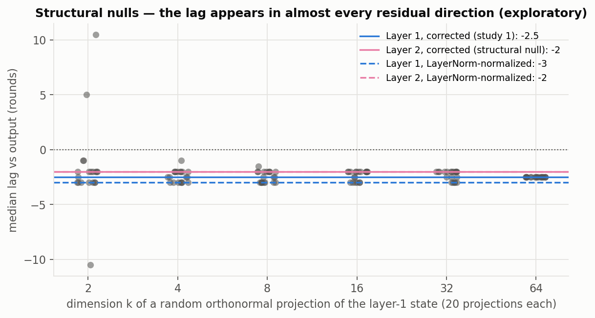
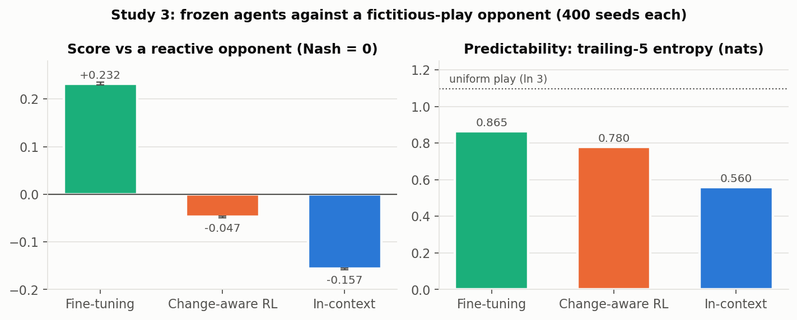

# Adaptive Agents

Detecting and adapting to regime change in competitive multi-agent settings.

When an adaptive agent's opponent changes strategy without warning, which
adaptation mechanism recovers fastest, and does the agent's internal
representation shift before, during, or after its behavior does?

The testbed is iterated Rock-Paper-Scissors. The opponent plays Strategy A,
(0.6, 0.2, 0.2), for 200 rounds, then switches without warning to Strategy
B, (0.2, 0.2, 0.6). Three agents are compared:

- **In-context:** a frozen transformer that reads the opponent's last 50
  moves.
- **Online fine-tuning:** a small policy network that takes one REINFORCE
  step per round.
- **Change-aware RL:** recency-weighted action values with surprise-scaled
  exploration.

Everything was pre-registered before any agent saw the test strategies:
[ANALYSIS_PLAN.md](ANALYSIS_PLAN.md) covers the statistics and
[AGENT_SPECS.md](AGENT_SPECS.md) covers the agents, the pretraining data
and tuning. Both files carry dated amendments for every later decision. The
confirmatory analysis ran once, from the tag
[`confirmatory-v1`](https://github.com/Mokhan02/Adaptive-Agents/tree/confirmatory-v1), and its output
[`results/confirmatory/results.json`](results/confirmatory/results.json) is
committed unedited.

## Results

### Summary of findings

1. **Adaptation: no single best adapter, and two claims retracted.** The
   pre-registered ranking (excess regret) puts the change-aware RL agent
   first. Total regret puts the in-context agent first by a factor of 4–5.
   RL's win comes from subtracting its own loose baseline, and the test
   pair happens to favor it. The claim that holding the test strategies out
   of pretraining affected performance was refuted by a control.
   [Details](#two-claims-retracted-after-checking).
2. **Early warning: open.** We set out to ask whether the agent's internal
   state gives notice of a regime switch before its behavior changes. The
   pre-registered lag (the state's displacement peaks 2.5 rounds after the
   output's) turned out to be a property of the measurement, not of
   representational timing (next item). A practical early-warning detector
   (detection delay at a matched 5% false-alarm rate) was designed for a
   follow-up study and found infeasible for this probe *before* it ran: it
   was unpowered, and biased under a planted null. So the question is
   neither answered yes nor answered no. [Study 2](#study-2-early-detection-designed-not-run).
3. **Methods: displacement-timing comparisons need a structural null.**
   Comparing when a residual-stream vector's displacement peaks with when the
   output's does produces a robust lag of about 2 rounds, even at a layer
   that determines the output in the same round, where no information lag is
   possible. It appears in random projections of every size from 4 to 64
   dimensions, and it survives LayerNorm normalization. Its mechanism is
   unresolved. What transfers is how it was caught: a structural null (a
   signal with a known zero lag, run through the identical pipeline), a
   validity condition on any fitted readout (one fitted on the training
   distribution did not transfer to the test pair, R² −0.02), and a
   dimension sweep. [Details](#structural-null-check-the-lag-is-a-property-of-the-measurement).

4. **Against a reactive opponent, the ranking reverses.** Study 3 swaps the
   scripted opponent for one that best-responds to the agent's recent play.
   The frozen agents are run unchanged, as a transfer test. Fine-tuning,
   last in study 1, now exploits the opponent (+0.23 per round). The
   in-context agent, first on total regret in study 1, is exploited most
   (−0.16). As pre-registered, predictability (the entropy of each agent's
   own recent play) orders the agents the same way as their scores.
   [Details](#study-3-a-reactive-opponent).

Every interpretation rule was fixed before its data existed. One verdict
landed exactly on an ambiguous endpoint of such a rule and is reported as
"on the boundary" rather than resolved after the fact. See the standing
conventions in [ANALYSIS_PLAN.md](ANALYSIS_PLAN.md).


> **Reframed (2026-09-28).** The pre-registered outcome below,
> "representation lags behavior", stays on record as it came out. A
> structural-null check has since shown that the lag doesn't support a claim
> about representational timing. Layer 2, which determines the output in the
> same round and so can have no information lag, shows the same pattern
> under the same pipeline. See [the structural-null check](#structural-null-check-the-lag-is-a-property-of-the-measurement).

### Pre-registered result: the probed state's displacement peaks 2–3 rounds after the output's

**The pre-registered test.** For the in-context agent after a hard switch,
we compared when the corrected layer-1 state at the final position moves
against when the output distribution moves.

| Test | Result |
|---|---|
| **Test A:** does the state respond to the switch? | **Passed.** U = 8527 of 10,000 (AUC 0.85), p < 10⁻⁴ |
| **Test B:** lead/lag, per-seed cross-correlation of displacements | **92 of 100 seeds negative**, median lag **−2.5 rounds**, 95% CI [−3, −2], sign test p = 3×10⁻¹⁹ |
| **Pre-registered outcome** | "Representation lags behavior", **reframed below** |


### Structural-null check: the lag is a property of the measurement

A pipeline dry run for a follow-up study showed the displacement-timing
method reporting a large "lag" between layer 2 and the output. Layer 2 feeds
the logits through one normalization and a linear map in the same round, so
no information lag is possible there. We then ran study 1's exact pipeline
with the state swapped for layer 2, on study 1's seeds, with the
interpretation rule fixed beforehand ([ANALYSIS_PLAN.md](ANALYSIS_PLAN.md),
"Structural-null check"):

| Signal vs output | Median lag [95% CI] | Seeds negative |
|---|---|---|
| Layer 1, corrected (study 1's headline, reproduced exactly) | −2.5 [−3, −2] | 92 / 100 |
| **Layer 2, corrected (no information lag possible)** | **−2.0 [−2, −1]** | **89 / 100** |
| Layer 2, raw | +2.0 [0, 5] | 25 of 82 nonzero |

**The verdict, from the rule fixed before the check ran (commit
`3aec7ef`; results in `68a2ea2`), is on a boundary.** The rule counts the
result as "comparable" if the median is in [−3.5, −1.5] (it is: −2.0), at
least 80% of nonzero seeds are negative (89%), and the CI overlaps study 1's
[−3, −2]. The CIs touch only at −2. The rule didn't say whether touching
counts as overlap:
- **Closed intervals** (the analysis code's reading, written before the
  run but committed with the result): **comparable**.
- **Open intervals:** **intermediate** ("partly explained by curve shape").
  The "meaningfully different" condition fails either way.

Either way, a layer with no possible information lag shows 2.0 of layer 1's
2.5 rounds. Layer 2 also reproduces the sign flip without the correction.

**The reframed reading:** residual-stream displacement peaks after output
displacement, a pattern also present at a layer with no possible information
lag. It therefore does not support a claim about representational timing.
At most about half a round could be specific to layer 1, and that difference
has not been tested.
**The mechanism is unresolved.** Two pre-registered explanations were
tested and disconfirmed:
- **Dimension mismatch** (a 64-dimensional residual dominated by
  directions the output never reads). Random projections as small as 4
  dimensions lag as much as the full state, about −2.4 rounds at every k
  from 4 to 64.
- **Magnitude drift through LayerNorm.** Normalizing each round's residual
  the way the model does leaves the lag in place: −3.0 at layer 1 and −2.0
  at layer 2.

Almost every direction of the residual moves about 2 rounds after the
output, while the output's own readout directions do not. A pre-set stop
rule ended the mechanism search there (see [ANALYSIS_PLAN.md](ANALYSIS_PLAN.md),
"Dimension diagnostics" and "LayerNorm diagnostic"). The small early bump in the overlay above is a
curve-shape effect as well: in a dry run, layer 2 showed the same "state
first" pattern early in the rise, where a real early signal is impossible.

**What remains true:** the numbers below are correct descriptions of these
displacement curves, and robust to how they're measured. What is withdrawn
is the interpretation that they say *when* the representation changes. The
proposal's early-warning question is open. Answering it needs a method that
compares the state against a structural null like layer 2, not against zero.



### Robust to analysis choices, not replicated

All checks below are exploratory, defined in the plan before they ran. They
reuse the confirmatory model, seeds and runs. They show the direction isn't
fragile to how it is measured; they are not a replication on new data. In
light of the structural-null check, they establish a robust property of the
displacement curves, not of representational timing. Four
of them reproduce the direction (logits, h = 28, h = 7, onset). The planted
signal and the untrained network are null controls: they show the pipeline
doesn't produce a negative lag on its own, and they are not confirmations.


| Check | Median lag [95% CI] | Seeds agreeing | What it addresses |
|---|---|---|---|
| Confirmatory (corrected state, h = 14) | −2.5 [−3, −2] | 92 / 100 | — |
| **Behavior = raw logits** | **−2.0 [−3, −2]** | **94 / 100** | Output saturation. The softmax-based scores saturate once the prediction flips, which could make them peak earlier. The unsaturated logits give the same answer, and a planted zero-lag signal with a saturating output stays at 0. |
| h = 28 | −2.0 [−3, −2] | 99 / 100 | Choice of displacement horizon |
| h = 7 | −2.5 [−3, −2] | 76 / 100 | Choice of horizon; noisier at short h |
| Onset difference (threshold crossing) | −3.0 [−5, −1] | 62 / 98 | Dependence on cross-correlation. This is the weakest support: 63% agreement, from noisy threshold crossings. |
| Untrained network | 0 on every seed | — | Artifacts of the pipeline or architecture. The untrained network's state and outputs move in lockstep. This is a weak control: it shows the pipeline doesn't create the effect, not how training does. |

### The sign depends on the latest-move correction, at both layers


Without the correction, the raw layer-1 state *leads*: median +4.5 rounds,
95% CI [2, 7], with 64 of 89 nonzero seeds positive. At the final position,
the raw state is dominated by the embedding of the latest move, which
explains 94–98% of its variance and changes at random every round. Raw
layer 2 flips the same way (+2.0). So the sign flip is also a property of
the measurement, not of layer 1.

### The exploratory agents' lead/lag is not testable by construction

For both the RL and the fine-tuning agent, every one of the 100 lags is
exactly 0. The sign test has no nonzero observations, so Test B is
undefined. That is not a "no lead/lag" finding.

- **RL:** expected and recorded in advance, since its state includes its
  output scores.
- **Fine-tuning: a design error found after the run.** Its state, the hidden
  layer, is one linear map from its logits. The spec had avoided exactly
  this for the in-context agent's final layer and missed it here. The
  spec's weight-displacement signal was also not computed by the
  confirmatory script, a deviation that was run afterwards as an
  exploratory check. The weight vector lags the logits by about 5 rounds
  (85 of 100 seeds). This follows almost by construction, because new moves
  change the logits immediately and gradient steps catch up later. It is
  not a second confirmation.

### Two claims retracted after checking

1. **"The hold-out mattered": refuted.** The in-context agent's excess
   regret rose from 11.9 on tuning episodes to 20.7 on A → B. That looked
   like the cost of adapting to strategies held out of pretraining. A
   control on 100 allowed opponent pairs with the same switch type and a
   similar switch size (TV 0.35–0.45) gives 22.8 ± 4.3, indistinguishable
   from A → B. The rise comes from the switch type and size, not from the
   held-out strategies.
2. **"RL adapts best": depends on the metric.** The pre-registered ranking
   (excess regret) puts RL first. Excess regret subtracts each agent's own
   pre-switch regret rate. The RL agent plays loosely throughout (steady
   regret 0.167 per round, against the in-context agent's 0.015), so a
   switch costs it little relative to its own baseline. On total regret,
   the order of the top two reverses.


| Agent | Excess regret, A → B (pre-registered) | Total regret, A → B (exploratory) | Excess regret, 100 comparable pairs (exploratory) | Median recovery (rounds) |
|---|---|---|---|---|
| In-context | 20.7 ± 2.2 | **24.5 ± 0.9** | 22.8 ± 4.3 | **30** |
| Change-aware RL | **7.6 ± 2.4** | 112.5 ± 1.4 | 21.5 ± 3.8 | 44 |
| Fine-tuning | 82.7 ± 3.6 | 139.7 ± 2.3 | 57.0 ± 5.4 | 162 |

There is no single "best adapter". Which agent leads depends on whether
regret is measured relative to the agent's own baseline or in absolute
terms. A → B also happens to favor RL: its excess regret there is 7.6,
against 21.5 on comparable pairs, where it ties the in-context agent. The
pre-registered ranking is reported with both caveats.

The fine-tuning agent's winning configuration sits at the lower edge of
its learning-rate search range, so its ranking may understate it. When its
switch comes after warm-up (round 941), 37 of 100 runs never recover.


### Study 2 (early detection): designed, not run

A follow-up study was designed to test first response directly, with its
own pre-registration ([PREREG_EARLY_DETECTION.md](PREREG_EARLY_DETECTION.md),
not frozen). It never reached its fresh test seeds:
- **The operational test** was detection delay at a matched 5% per-run
  false-alarm rate. Planted-signal power simulations found it unpowered
  (41% inconclusive even at 3,200 seeds) and biased toward "state first"
  under a planted null (19% at 3,200 seeds). The bias came from the rule
  that a signal that never fires counts as later, combined with the two
  signals' unequal detection rates. The state's response is 0.13 [0.10,
  0.15] of its threshold, against the output's 0.33 [0.26, 0.41].
- **Its replacement** compared normalized timing of the mean curves. It
  needed smoothing, a sustained-crossing rule and a cross-fitted peak to be
  unbiased in planted tests. Its dry run then showed the layer-2 negative
  control far from 0, which led to the structural-null finding above.
  Study 2 is on hold. A redesign would have to compare the state against a
  structural null rather than against zero.

### Study 3: a reactive opponent

Studies 1–2 used a scripted opponent: nonstationary, but not competitive.
Study 3 ([ANALYSIS_PLAN.md](ANALYSIS_PLAN.md), "Study 3"; tag `study3-v1`)
replaces it with a fictitious-play opponent. It best-responds to the
agent's last 5 moves, and plays uniformly at random 10% of the time.

- **The three agents are frozen,** so this is a transfer test.
- **The in-context agent is handicapped by design, and this is part of the
  hypothesis:** it sees only the opponent's moves, never its own, and never
  met a reactive opponent in pretraining.
- **The metric** is expected reward per round, with 0 as the Nash baseline:
  uniform play earns exactly 0 against any opponent.
- **Calibration used only reference agents,** never the three frozen ones.



| Agent | Score [95% CI] | Against Nash | Trailing-5 entropy |
|---|---|---|---|
| Fine-tuning | **+0.232** [0.229, 0.235] | exploits the opponent | 0.865 |
| Change-aware RL | −0.047 [−0.049, −0.046] | exploited | 0.780 |
| In-context | **−0.157** [−0.159, −0.155] | exploited | 0.560 |

- **Every pair is separated** by far more than the 0.02 effect of
  interest, with Holm-adjusted p at the bootstrap floor. The ranking changes
  against both of study 1's orderings.
- **The pre-registered prediction, H1, is confirmed** as an ordinal check
  on three agents (not a statistical test). The agents' order by entropy
  matches their order by score, with the in-context agent lowest on both.
  RL's near-random play leaves the opponent's tracker almost nothing to
  lock onto: in 394 of 400 runs there is no cycle in the opponent's best
  responses. That is consistent with H1, but for this agent it isn't a
  second finding. Near-random play is both high-entropy and unordered, so
  one cause produces both numbers. In general the two measures differ:
  entropy describes the mix of moves and cycling describes their order.
  Repeating rock-paper-scissors has maximal entropy and a perfect
  3-round cycle.

**Demonstrated:** fine-tuning wins by a wide, well-powered margin, and it
is the only agent that exploits the opponent. It is also the only agent
that both conditions on recent history *and* changes its mapping during
play. RL updates every round but has no context input; the in-context
agent reads context, but its mapping is frozen.

**Not tested:** *why* fine-tuning wins. The result is *consistent with* it
learning the opponent's reaction rule. The opponent answers the agent's
last 5 moves, which correlate with the opponent's own recent moves, which
is what fine-tuning reads. The saved data can't check this. A follow-up
could test whether the advantage shrinks as the opponent's window grows.
H1 explains who gets exploited, not fine-tuning's exploitation of the
opponent.

**Bridge condition (exploratory).** The opponent plays study 1's scripted
Strategy A for 200 rounds, then turns reactive. Every measure is computed
per phase, never pooled:

| Agent | Scripted phase: score / entropy | First 200 reactive rounds | Settled reactive |
|---|---|---|---|
| In-context | **+0.383** / 0.05 | −0.161 | −0.152 |
| Change-aware RL | +0.219 / 0.55 | −0.052 | −0.046 |
| Fine-tuning | +0.172 / 0.68 | −0.079 | **+0.243** |

- **The two phases reward opposite traits.** The in-context agent's
  near-deterministic play is almost optimal against the script, and is
  exploited as soon as the opponent reacts.
- **Only fine-tuning improves during the reactive phase.** The others are
  flat. That is a demonstrated within-episode change, still consistent with
  (not proof of) the tracking mechanism.
- **Starting from the script changes no agent's settled score by more than
  0.011,** below the 0.02 effect of interest.

**Also on record:** a dry run on a different opponent from the same
family, run before the tag, previewed this direction. It is disclosed in
the plan, and nothing was adjusted in response.

## How it was done

1. **Pre-registration.** Hypotheses, tests and the outcome mapping were
   written before any results existed: [ANALYSIS_PLAN.md](ANALYSIS_PLAN.md).
2. **Held-out test strategies.** The in-context agent is pretrained on
   random regime-switching opponents. Every strategy within
   total-variation distance 0.10 of A, B, or their third cyclic rotation is
   excluded, including mid-transition blends.
3. **Equal tuning.** Each agent gets 30 random configurations, scored on the
   same 200 pretraining-distribution episodes, never on A or B.
4. **Calibration** (seeds 10000+) sets each agent's warm-up cutoff,
   displacement horizon h, analysis window and lag range.
5. **One confirmatory run** from a tagged commit, on seeds 0–99 (controls
   1000–1099).
6. **Exploratory follow-ups,** each defined in the plan before it ran.

Drift is displacement over h rounds, not step-to-step distance. A switch
makes the state's steps point consistently one way without making them
bigger, and one-step distance is blind to that (see the plan).

## Reproduce

```bash
pip install -e ".[dev,torch]"
pytest                                            # includes planted-signal checks of the analysis
python scripts/pretrain_icl.py --run-dir runs/icl # or scripts/tune_icl.py for the full sweep (GPU helps)
python scripts/tune.py --agent change_aware       # CPU sweeps
python scripts/calibrate.py --agent in_context
python scripts/confirmatory.py --dry-run          # pipeline check on a non-test pair
python scripts/exploratory.py icl                 # follow-ups: saturation, icl, untrained, remaining,
python scripts/exploratory.py structural-null     #   structural-null, dimension, layernorm
python scripts/early_detection.py timing-power    # study 2 design (power, diagnose, bias, strengths, run --dry-run)
python scripts/make_figures.py
```

The frozen model, tuning results, calibration and confirmatory results are
all committed. Results reproduce to within floating-point noise across
machines, not bit-for-bit.

## Layout

```
src/regime/
  env.py          RPS payoffs, oracle, regime-switching opponent (hard / gradual / no-switch control)
  runner.py       run_episode -> EpisodeLog (policies, output scores, internal states, regret)
  metrics.py      regret, recovery time, excess regret
  pretrain.py     pretraining opponents with the held-out exclusion
  tuning.py       tuning protocol and scoring
  analysis.py     calibration, Test A, Test B
  agents/         in-context transformer, fine-tuning and RL agents, reference baselines
scripts/          pretraining, sweeps, calibration, confirmatory run, follow-ups, figures
models/           frozen in-context model (weights + move offsets, tied by hash)
results/          tuning, calibration, confirmatory and exploratory outputs
figures/          README figures
```
