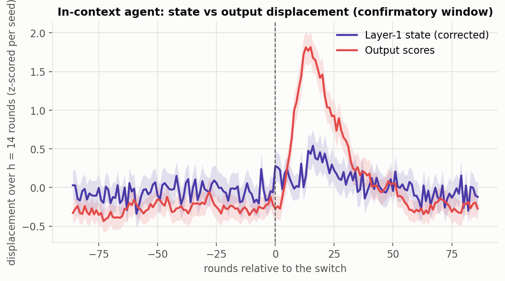
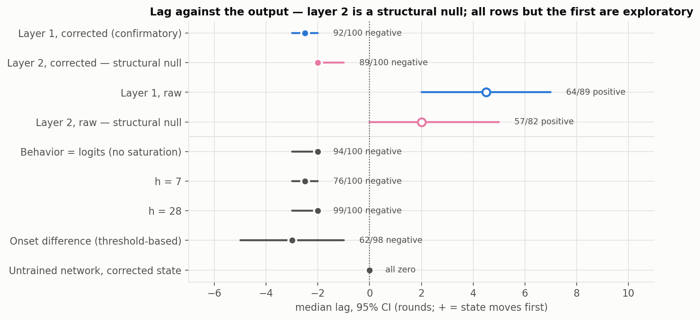
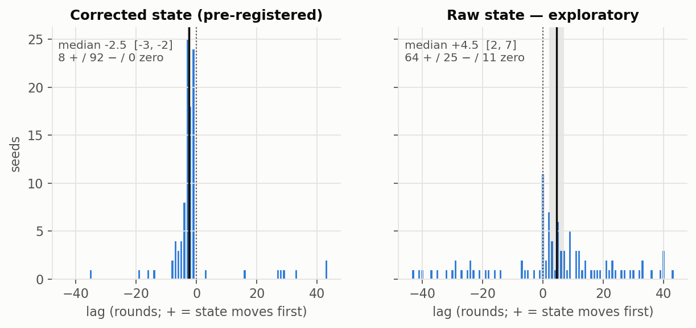
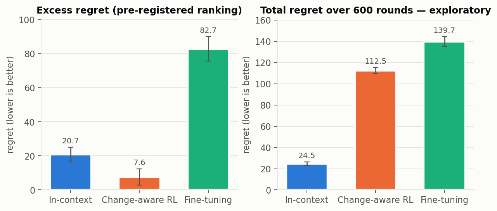
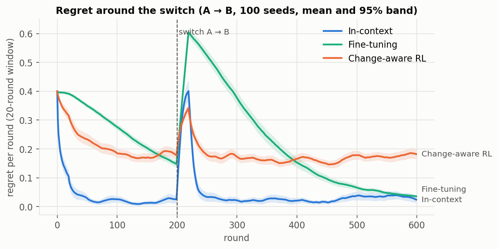

# Adaptive Agents

Detecting and adapting to regime change in competitive multi-agent settings.

When an adaptive agent's opponent changes strategy without warning, which
adaptation mechanism recovers fastest, and does the agent's internal
representation shift before, during, or after its behavior does?

The testbed is iterated Rock-Paper-Scissors. The opponent plays Strategy A,
(0.6, 0.2, 0.2), for 200 rounds, then switches without warning to Strategy
B, (0.2, 0.2, 0.6). Three agents are compared:

- **In-context:** a frozen transformer that reads the opponent's last 50
  moves.
- **Online fine-tuning:** a small policy network that takes one REINFORCE
  step per round.
- **Change-aware RL:** recency-weighted action values with surprise-scaled
  exploration.

Everything was pre-registered before any agent saw the test strategies:
[ANALYSIS_PLAN.md](ANALYSIS_PLAN.md) covers the statistics and
[AGENT_SPECS.md](AGENT_SPECS.md) covers the agents, the pretraining data
and tuning. Both files carry dated amendments for every later decision. The
confirmatory analysis ran once, from the tag
[`confirmatory-v1`](https://github.com/Mokhan02/Adaptive-Agents/tree/confirmatory-v1), and its output
[`results/confirmatory/results.json`](results/confirmatory/results.json) is
committed unedited.

## Results

> **Under review (2026-09-28): the primary result's interpretation is in
> question, pending a structural-null check.** A pipeline dry run for a
> follow-up study found that the same displacement-timing method reports
> a large "lag" between layer 2 and the output. Layer 2 determines the
> output in the same round, so no real information lag is possible there.
> That suggests the method may be measuring the shape of the displacement
> curves rather than when information arrives. A check of layer 2 against
> the output with study 1's exact pipeline is defined in
> [ANALYSIS_PLAN.md](ANALYSIS_PLAN.md) ("Structural-null check"). Until it
> is reported, read the lag below as a property of these displacement
> curves, not as evidence about representational timing. The early bump in
> the overlay figure is already known to be a shape effect (see the same
> section).

### Pre-registered result: the probed representation lags behavior by 2–3 rounds

**The claim.** For the in-context agent after a hard switch, the corrected
layer-1 state at the final position moves after the output distribution
does, by a median of 2.5 rounds.

| Test | Result |
|---|---|
| **Test A:** does the state respond to the switch? | **Passed.** U = 8527 of 10,000 (AUC 0.85), p < 10⁻⁴ |
| **Test B:** lead/lag, per-seed cross-correlation of displacements | **92 of 100 seeds negative**, median lag **−2.5 rounds**, 95% CI [−3, −2], sign test p = 3×10⁻¹⁹ |
| **Pre-registered outcome** | **Representation lags behavior** |



**Scope.** The probe is one slice of the network: the layer-1 residual
stream at the final position, with the latest move's mean contribution
removed. The output depends on every position and on layer 2. So the result
says *this probe* lags the outputs, not that the network's computation does.
Against the proposal's early-warning motivation, it counts only at this
probe site. Later layers and attention patterns were not tested. The claim
holds for this agent, this game, this switch type and this probe site.
Test A is a weak gate for this agent, because any function of the move
window responds to a switch, so the evidence is in Test B.

### Robust to analysis choices, not replicated

All checks below are exploratory, defined in the plan before they ran. They
reuse the confirmatory model, seeds and runs. They show the direction isn't
fragile to how it is measured; they are not a replication on new data. Four
of them reproduce the direction (logits, h = 28, h = 7, onset). The planted
signal and the untrained network are null controls: they show the pipeline
doesn't produce a negative lag on its own, and they are not confirmations.



| Check | Median lag [95% CI] | Seeds agreeing | What it addresses |
|---|---|---|---|
| Confirmatory (corrected state, h = 14) | −2.5 [−3, −2] | 92 / 100 | — |
| **Behavior = raw logits** | **−2.0 [−3, −2]** | **94 / 100** | Output saturation. The softmax-based scores saturate once the prediction flips, which could make them peak earlier. The unsaturated logits give the same answer, and a planted zero-lag signal with a saturating output stays at 0. |
| h = 28 | −2.0 [−3, −2] | 99 / 100 | Choice of displacement horizon |
| h = 7 | −2.5 [−3, −2] | 76 / 100 | Choice of horizon; noisier at short h |
| Onset difference (threshold crossing) | −3.0 [−5, −1] | 62 / 98 | Dependence on cross-correlation. This is the weakest support: 63% agreement, from noisy threshold crossings. |
| Untrained network | 0 on every seed | — | Artifacts of the pipeline or architecture. The untrained network's state and outputs move in lockstep. This is a weak control: it shows the pipeline doesn't create the effect, not how training does. |

### The sign depends on the latest-move correction



Without the correction, the raw state *leads*: median +4.5 rounds, 95% CI
[2, 7], with 64 of 89 nonzero seeds positive. At the final position, the raw
state is dominated by the embedding of the latest move. That embedding
explains 94–98% of the state's variance and changes at random every round.
The correction was fixed in an amendment
([AGENT_SPECS.md](AGENT_SPECS.md), 2026-09-27) before any model saw the
test strategies, and the amendment says explicitly that the choice is not
conditional on results. That is why the pre-registered corrected definition
decides the headline. The dependence on it is still part of the result.

### The exploratory agents' lead/lag is not testable by construction

For both the RL and the fine-tuning agent, every one of the 100 lags is
exactly 0. The sign test has no nonzero observations, so Test B is
undefined. That is not a "no lead/lag" finding.

- **RL:** expected and recorded in advance, since its state includes its
  output scores.
- **Fine-tuning: a design error found after the run.** Its state, the hidden
  layer, is one linear map from its logits. The spec had avoided exactly
  this for the in-context agent's final layer and missed it here. The
  spec's weight-displacement signal was also not computed by the
  confirmatory script, a deviation that was run afterwards as an
  exploratory check. The weight vector lags the logits by about 5 rounds
  (85 of 100 seeds). This follows almost by construction, because new moves
  change the logits immediately and gradient steps catch up later. It is
  not a second confirmation.

### Two claims retracted after checking

1. **"The hold-out mattered": refuted.** The in-context agent's excess
   regret rose from 11.9 on tuning episodes to 20.7 on A → B. That looked
   like the cost of adapting to strategies held out of pretraining. A
   control on 100 allowed opponent pairs with the same switch type and a
   similar switch size (TV 0.35–0.45) gives 22.8 ± 4.3, indistinguishable
   from A → B. The rise comes from the switch type and size, not from the
   held-out strategies.
2. **"RL adapts best": depends on the metric.** The pre-registered ranking
   (excess regret) puts RL first. Excess regret subtracts each agent's own
   pre-switch regret rate. The RL agent plays loosely throughout (steady
   regret 0.167 per round, against the in-context agent's 0.015), so a
   switch costs it little relative to its own baseline. On total regret,
   the order of the top two reverses.



| Agent | Excess regret, A → B (pre-registered) | Total regret, A → B (exploratory) | Excess regret, 100 comparable pairs (exploratory) | Median recovery (rounds) |
|---|---|---|---|---|
| In-context | 20.7 ± 2.2 | **24.5 ± 0.9** | 22.8 ± 4.3 | **30** |
| Change-aware RL | **7.6 ± 2.4** | 112.5 ± 1.4 | 21.5 ± 3.8 | 44 |
| Fine-tuning | 82.7 ± 3.6 | 139.7 ± 2.3 | 57.0 ± 5.4 | 162 |

There is no single "best adapter". Which agent leads depends on whether
regret is measured relative to the agent's own baseline or in absolute
terms. A → B also happens to favor RL: its excess regret there is 7.6,
against 21.5 on comparable pairs, where it ties the in-context agent. The
pre-registered ranking is reported with both caveats.

The fine-tuning agent's winning configuration sits at the lower edge of
its learning-rate search range, so its ranking may understate it. When its
switch comes after warm-up (round 941), 37 of 100 runs never recover.



## How it was done

1. **Pre-registration.** Hypotheses, tests and the outcome mapping were
   written before any results existed: [ANALYSIS_PLAN.md](ANALYSIS_PLAN.md).
2. **Held-out test strategies.** The in-context agent is pretrained on
   random regime-switching opponents. Every strategy within
   total-variation distance 0.10 of A, B, or their third cyclic rotation is
   excluded, including mid-transition blends.
3. **Equal tuning.** Each agent gets 30 random configurations, scored on the
   same 200 pretraining-distribution episodes, never on A or B.
4. **Calibration** (seeds 10000+) sets each agent's warm-up cutoff,
   displacement horizon h, analysis window and lag range.
5. **One confirmatory run** from a tagged commit, on seeds 0–99 (controls
   1000–1099).
6. **Exploratory follow-ups,** each defined in the plan before it ran.

Drift is displacement over h rounds, not step-to-step distance. A switch
makes the state's steps point consistently one way without making them
bigger, and one-step distance is blind to that (see the plan).

## Reproduce

```bash
pip install -e ".[dev,torch]"
pytest                                            # includes planted-signal checks of the analysis
python scripts/pretrain_icl.py --run-dir runs/icl # or scripts/tune_icl.py for the full sweep (GPU helps)
python scripts/tune.py --agent change_aware       # CPU sweeps
python scripts/calibrate.py --agent in_context
python scripts/confirmatory.py --dry-run          # pipeline check on a non-test pair
python scripts/exploratory.py icl                 # follow-ups; see the script for the others
python scripts/make_figures.py
```

The frozen model, tuning results, calibration and confirmatory results are
all committed. Results reproduce to within floating-point noise across
machines, not bit-for-bit.

## Layout

```
src/regime/
  env.py          RPS payoffs, oracle, regime-switching opponent (hard / gradual / no-switch control)
  runner.py       run_episode -> EpisodeLog (policies, output scores, internal states, regret)
  metrics.py      regret, recovery time, excess regret
  pretrain.py     pretraining opponents with the held-out exclusion
  tuning.py       tuning protocol and scoring
  analysis.py     calibration, Test A, Test B
  agents/         in-context transformer, fine-tuning and RL agents, reference baselines
scripts/          pretraining, sweeps, calibration, confirmatory run, follow-ups, figures
models/           frozen in-context model (weights + move offsets, tied by hash)
results/          tuning, calibration, confirmatory and exploratory outputs
figures/          README figures
```
